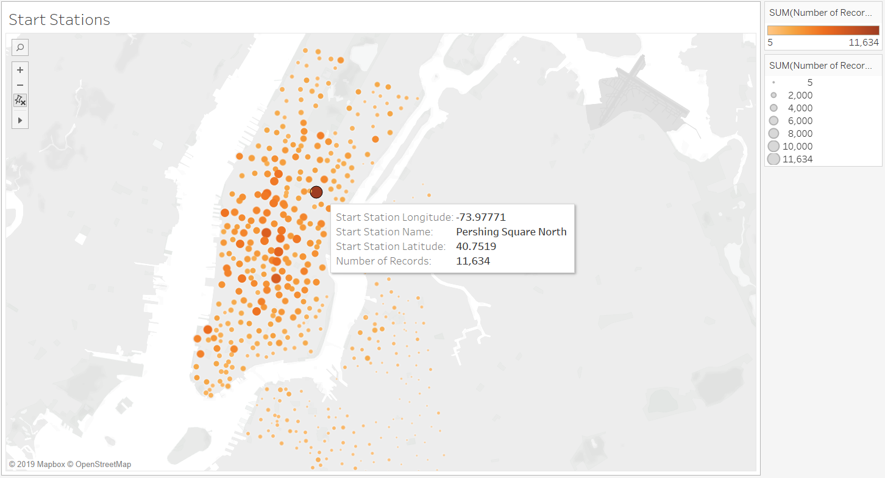
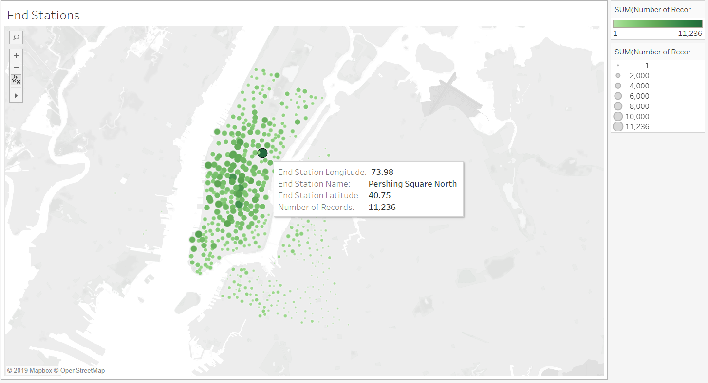
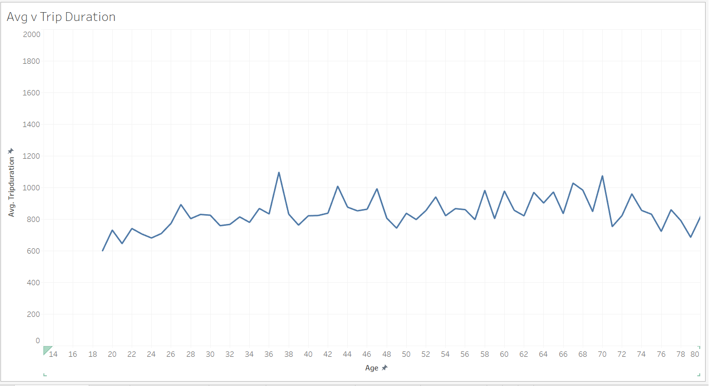
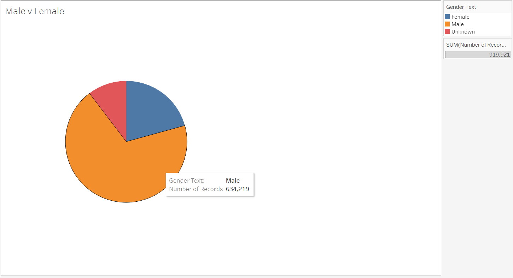
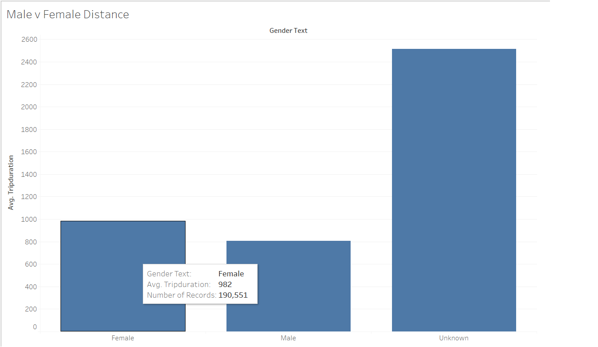
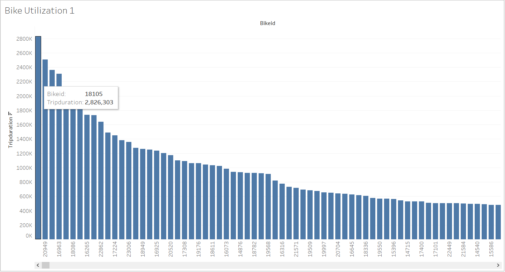

# Tableau Challenge Citi Bike Data
Tableau Visualization Tool for Citi Bike Data

## Intuitive Findings from the Data
1. The station that has the highest frequency to start and end using the bike is at Pershing Square North Station.  This frequency data suggest which station or area has the most traffic of Citi bike use in New Yord City.

2. The average trip duration is range around 600 - 1,100 across user age from 18 to 80.  There are some very extreme outliners in the data, which suggest the average trip durating for two 92 year old users is 8,781.  It is an indication that the data may need to be cleaned. 

3. Out of total 919,921 record, male accounts for 634,219 record (approx. 68.94%), female accounts for 190,551 (approx. 20.71%), and 95,151 records are unknown.

4. The average trip duration for male is 807 and for female is 982, which suggests that female on average utilize the bike more than male user regardless the total record is dominated by male users.

5. According to the bike utilization graph, we can easily visualize which bikes need to be check for maintainence to ensure quality of the bikes in the city.

